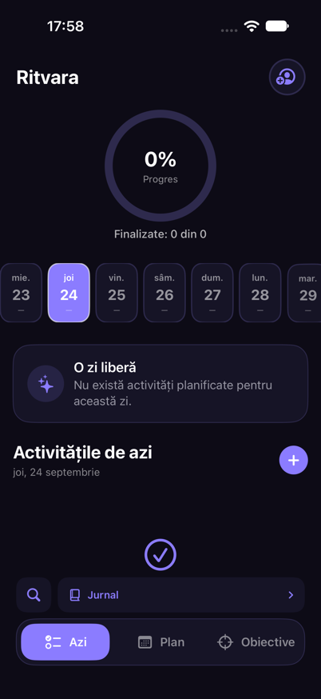
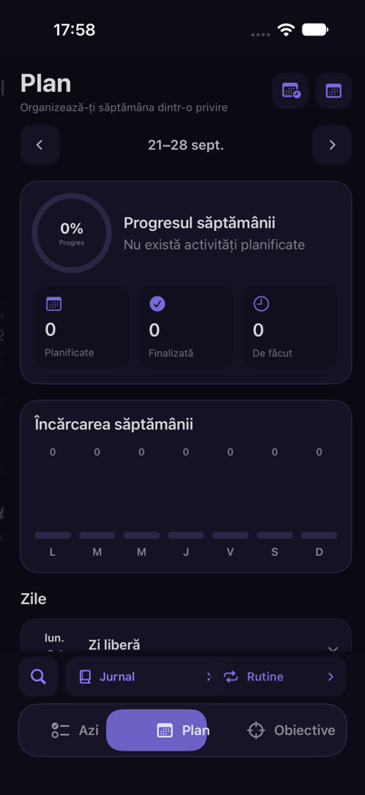

# Ritvara

Aplicație iOS pentru organizarea activităților, construirea rutinelor și urmărirea progresului personal.

[Română](#despre-proiect) · [English](#english-version)

## Despre proiect

Ritvara este primul meu proiect dezvoltat în Swift. Am început aplicația pentru a învăța practic SwiftUI, persistența datelor și organizarea unui proiect iOS, pornind de la o nevoie simplă: un loc în care să îmi pot planifica activitățile și urmări consecvența.

Proiectul a evoluat treptat de la o listă de activități la o aplicație care include rutine, obiective, jurnal, notificări și statistici. Este în continuare un proiect personal de învățare, pe care îl îmbunătățesc pe măsură ce descopăr concepte și practici noi.

## Funcționalități

- creare, editare, duplicare și ștergere a activităților;
- stări pentru activități: de făcut, finalizată și omisă;
- rutine recurente și planificare săptămânală;
- obiective personale, jurnal și istoric lunar;
- progres zilnic și statistici săptămânale;
- notificări configurabile și Live Activity;
- căutare și filtrare;
- backup și restaurare în format JSON;
- interfață disponibilă în română și engleză.

## Capturi de ecran

| Astăzi | Plan săptămânal |
|---|---|
|  |  |

## Tehnologii folosite

- Swift și SwiftUI pentru interfață și logica aplicației;
- SwiftData pentru salvarea locală;
- UserNotifications pentru notificări;
- ActivityKit pentru Live Activity;
- String Catalogs pentru localizare;
- Git și GitHub pentru versionare.

## Procesul de dezvoltare

### Planificare și bază

Am stabilit scopul aplicației, structura ecranelor și modelul activităților. Am implementat operațiile de bază și salvarea locală cu SwiftData.

### Interfață și organizare

Am construit componente SwiftUI reutilizabile și am organizat proiectul în `Models`, `Views`, `Components`, `Services` și `Utilities`.

### Funcții principale

Am adăugat rutine recurente, planificare săptămânală, obiective, jurnal, căutare, filtre, notificări și urmărirea progresului.

### Siguranța datelor și verificare

Am implementat backupul și restaurarea datelor, apoi am adăugat verificări pentru recurență, migrarea datelor și importul backupurilor.

### Finisare

Am introdus localizarea în română și engleză, profilul utilizatorului, Live Activity și îmbunătățiri de accesibilitate și utilizare.

## Rulare

1. Clonează repository-ul sau descarcă proiectul.
2. Deschide `DisciplineTracker.xcodeproj` în Xcode.
3. Selectează un simulator sau un iPhone.
4. Alege echipa personală în `Signing & Capabilities`, dacă rulezi pe un dispozitiv fizic.
5. Rulează proiectul cu `Command + R`.

## Ce am învățat

Prin acest proiect am învățat să construiesc o aplicație SwiftUI pornind de la o idee, să lucrez cu date persistente, notificări, localizare și Git și să îmbunătățesc o aplicație în pași mici.

## Autor

Robert Balaban

---

## English version

Ritvara is an iOS application for organizing tasks, building routines, and tracking personal progress.

### About the project

Ritvara is my first project built with Swift. I started it as a practical way to learn SwiftUI, data persistence, and the structure of an iOS application while creating something useful for everyday planning.

The project gradually grew from a simple task list into an application with routines, goals, journaling, notifications, and progress insights. It remains a personal learning project that I continue to improve as I learn new concepts and development practices.

### Features

- create, edit, duplicate, and delete tasks;
- pending, completed, and skipped task states;
- recurring routines and weekly planning;
- personal goals, journal, and monthly history;
- daily progress and weekly insights;
- configurable notifications and Live Activity;
- search and filtering;
- JSON backup and restore;
- Romanian and English localization.

### Screenshots

| Today | Weekly plan |
|---|---|
|  |  |

### Technologies

Swift, SwiftUI, SwiftData, UserNotifications, ActivityKit, String Catalogs, Git, and GitHub.

### Running the project

1. Clone the repository or download the project.
2. Open `DisciplineTracker.xcodeproj` in Xcode.
3. Select a simulator or an iPhone.
4. Choose your personal team under `Signing & Capabilities` when using a physical device.
5. Run the project with `Command + R`.

### Author

Robert Balaban
